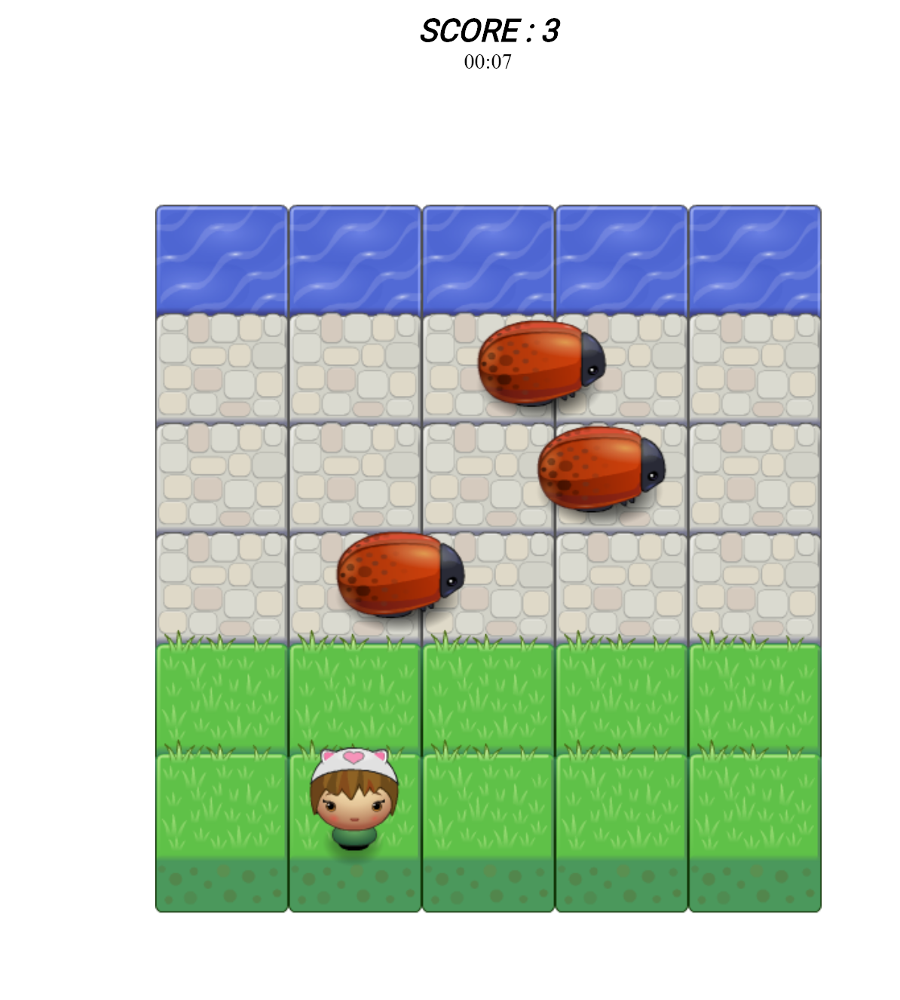

'frontend-nanodegree-arcade-game
===============================

Students should use this [rubric](https://review.udacity.com/#!/projects/2696458597/rubric) for self-checking their submission. Make sure the functions you write are **object-oriented** - either class functions (like Player and Enemy) or class prototype functions such as Enemy.prototype.checkCollisions, and that the keyword 'this' is used appropriately within your class and class prototype functions to refer to the object the function is called upon. Also be sure that the **readme.md** file is updated with your instructions on both how to 1. Run and 2. Play your arcade game.

For detailed instructions on how to get started, check out this [guide](https://docs.google.com/document/d/1v01aScPjSWCCWQLIpFqvg3-vXLH2e8_SZQKC8jNO0Dc/pub?embedded=true).

# Arcade game clone

## Table of Contents

* [Motivation](#motivation)
* [Description](#description)
* [Tools](#tools)
* [Files](#files)
* [Installation](#installation)
* [Result](#result)
* [Instructions](#instructions)
* [Contributing](#contributing)

## Motivation

The Arcade game clone is the project of Udacity Front-End Web Development Nanodegree.

## Description

This is a fun game. The object of the game is for player to safely make it throw the road to the river.
Player must not collide with the enemies - bugs.

New game starts every time after collision with enemies. After collision the screen flashes yellow color, the word 'Disaster' popped out,
and player returned to the start (new position each time). Timer starts over too.

If player reached the river without collision with enemies, he earns one score, the word 'WOOHOO!' pops out and time keeps going.

The feature of collecting treasures is still under development.

## Tools

This game was build with:
 [jQuery3.3.1](https://ajax.googleapis.com/ajax/libs/jquery/3.3.1/jquery.min.js)
 [HTML](https://developer.mozilla.org/en-US/docs/Glossary/HTML),
 [JavaScript](https://developer.mozilla.org/en-US/docs/Web/JavaScript),
 [CSS](https://developer.mozilla.org/en-US/docs/Glossary/CSS),
 [jQuery](https://developer.mozilla.org/en-US/docs/Glossary/jQuery)

## Files

This game consists from 3 folders and 2 files:
- css:
  - style.css
- js:
  - app.js,
  - engine.js,
  - resources.js
- images:
  - contains different player and ememies images
- index.html
- README.md
- CONTRIBUTING.md

## Installation

There are two ways of opening the game:

 1 In order to play this game, please open index.html file in Google Chrome browser and play.
 2
   2.1. Python 3: In terminal run python -m http.server 8000
   2.2. Python 2: In termonal run python -m SimpleHTTPServer 8000
   2.2. Open localhost:8000 and play the game

## Instructions

* Start the game
* Use arrows 'Up', 'Down', 'Left', 'Right' to move player.
* Try to get to the river without collision with enemies.
* Once you've got to the river your score is updated by +1.
* Enjoy the game!

## Result

After each time you reach the river your score would increase. You can also try to play as long as possible without collision with enemies.

## Contributing

This repository is the starter code for _all_ Udacity students. Therefore, we most likely will not accept pull requests.

For details, check out [CONTRIBUTING.md](CONTRIBUTING.md).
